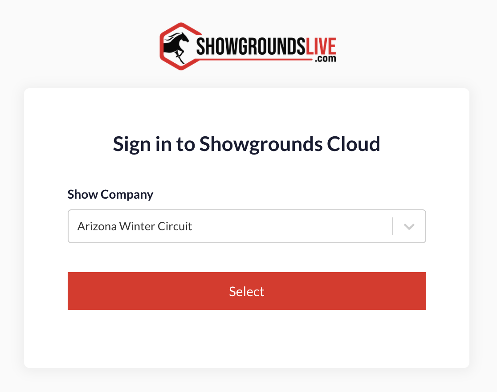

# Logging into Beta

## Getting to the Beta Site

The URL for the Beta Testing website is: \
\
&#x20;[https://beta.showgroundslive.com](https://beta.showgroundslive.com/auth)

## Credentials for Beta

<figure><figcaption></figcaption></figure>

You will login to the Beta using the  credentials as you use today for our existing software.&#x20;

Please login using your ShowGroundsLive login and password.

#### Password Change

One thing to keep in mind, is if you change your password on the current operating system while beta is running, that password change **will not** replicate over to the beta system. What your username and password is at the beginning of beta is what it will be for the entirety of beta testing. If you need a password reset, please contact support for assistance.&#x20;

#### Credentials on Shared Devices

If you are testing beta on a shared computer, please make sure that you are not saving your credentials in your browser. You CAN use the "Remember Me" option at login, but saving your credentials in the browser should not be used for shared devices.&#x20;

#### Forgot Password?

If you cannot remember your password and try to use the Forgot Password? option, that will not work on this site as no emails are sent from this site.&#x20;

<figure><figcaption></figcaption></figure>

## Logging in & multi company access

One major change in this system is that users with permissions with multiple show companies can change between those companies quickly and easily.&#x20;

At login you will be presented with a drop down menu to select which company you are going to access.  Your list of companies will be limited to those you have access to.

<figure><figcaption></figcaption></figure>

## Switching companies

Once you are in the system you may also switch between show companies easily.  Simply select the&#x20;

<figure><figcaption></figcaption></figure>

