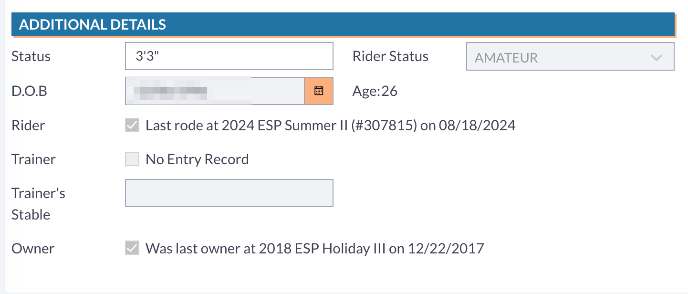

# Beta Updates

## Latest Updates

The development team has added an option to “print to disk” to print reports to a .csv file as seen below.

<figure><figcaption></figcaption></figure>

Please note, this is not yet enabled for all reports due to upgraded design requirements. The development team will be working through reports and enabling as they go!

### Entry Count

There was an issue in beta that the entry count for a class was not updating in the list view until the roster was verified in the class. This has been fixed.&#x20;

### Roster Verification

When verifying the roster in a class in beta, the process was not as streamlined as it had previously been in the current system. Users could not use the enter key to move through the entry numbers.&#x20;

This has been fixed to allow users to input an entry number in the entry box and then hit enter to move it to the Verified Entries column.&#x20;

<figure><figcaption></figcaption></figure>

Once the user enters the number and hits enter, the entry will move to the verified entries column and the user can quickly continue with the rest of the entries.&#x20;

<figure><figcaption></figcaption></figure>

### Same Day Add Fee

A new feature to allow a "same day add" fee to classes has been added. In order to utilize this feature, the user should navigate to the particular class they would like to add this fee to. Under Class rules, the user should select "Day of Add Fee" as seen below. Once added, any adds the day of the class will have the fee added.

<figure><figcaption></figcaption></figure>

### RTO Age

In the RTO account of a person, it will show the age and birthday of that person. For the "show age" of a person to show correctly in the RTO account, the governing organization has to be set correctly for that show company. There was also an issue where the actual age of the person was showing incorrectly.&#x20;

<figure><figcaption></figcaption></figure>

### Rider Status on an Entry

The rider's status was not showing on entries found in Beta. The team has fixed this for that rider's status to update when a rider is added or updated on the entry.&#x20;

<figure><figcaption></figcaption></figure>
