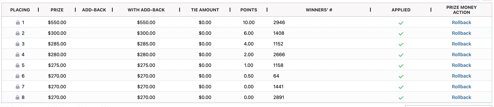

# Prize Money

## Introduction

There are a nuumber of changes to how prize money is managed in the system.  These changes are designed to create better compliance with tax status of prize money recipients and to reduce the number of cases where prize money gets reversed and reapplied.

There are some very important new features that make managing prize money easier and more accurate.

## Flow of Prize Money

In the old system prize money flowed in a particular way in terms of transactions.  The following diagram shows how money from prize money would applied to an entry.  Any remaining credit would then be transferred to the account register and ultimately result in a prize money check.

<figure><figcaption>
Old flow of prize money
</figcaption></figure>

In the new system the way prize money flows is different.  For starters we have elected to leave prize money unapplied and stored in the class until generally later i the process. The goal of this change is to only utilize prize money at the time its needed to be paid.  By doing this we hope to reduce the number of transactions that occur to reverse incorrect prize money and generally have a more streamlined and simplified transaction history.

When prize money is utilized it first is applied to the account register of the prize money recipient.  Once it is applied there we then determine if the necessary tax information is in place to make the prize money payable.  If it is payable then it can be transferred as a credit to pay an entry balance or to be issued as a prize money check.\

<figure><figcaption></figcaption></figure>

In this example prize money is applied to the account register of the prize money recipient.  A portion is then transferred to an entry as a payment and the remainder is paid in a prize money check.

## Rolling-back Prize Money

In our old system when prize money was applied from a class all entries would have prize money applied.  If there were changes in results or prize money all placing and prize money had to be reversed and the reapplied.

In the new system it is now possible to rollback prize money for individual placings.

<figure><figcaption></figcaption></figure>

## Entry - Prize Money Summary

We now track a prize money summary on each entry to make it clear the status of prize money.

Whenever prize money is applied or rolled back, the prize money box is updated in the entry detail.\

<figure><figcaption></figcaption></figure>

### Definitions

* **Won:** The total amount of prize money won by the entry.
* **Unapplied**: Prize money won by the entry but not yet applied.
* **Applied:** Prize money won by the entry and already applied
* **Tax Withheld:** The withholding tax deducted from the prize money won when it is applied to the entry.
* **Payment Applied:** The amount of prize money used to pay off the current entry.

***

## Transfer Prize Money

**Areas:** Prize Money can be transferred to account register from following areas.

* Class Detail
* Entry Detail
* Transfer Prize Money to PMR Quick Action
* Payment Batch - Move Credit To Account
* Add Payment From Entry
* Apply Payments Quick Action

**Note:** Prize money can be transferred to account register from all the above areas, but the prize money payment is applied to the entry only from ‘Add Payment From Entry’ and ‘Apply Payments Quick Action.’

### **1 - Class Detail:**&#x20;

Prize money can be transferred to account register by clicking on the ’Transfer'

<figure><figcaption></figcaption></figure>

When prize money is transferred, the class is saved first, and then the prize money is transferred. Once the prize money is transferred, the trip will be locked, and the trip data cannot be updated.

<figure><figcaption></figcaption></figure>

Note: Trips with unapplied prize money can be updated.

### 2 - Entry Detail:&#x20;

Prize money can be applied from ‘Prize Money Action’ present in Classes Tab.

<figure><figcaption></figcaption></figure>

Once the prize money is applied then _‘Prize Money Action’_ will become unselectable and a message will be displayed.

<figure><figcaption></figcaption></figure>

&#x20;The Prize Money Box will be updated to show the prize money applied.

<figure><figcaption></figcaption></figure>

**Note**: Prize money changes will be saved when the entry is saved.

### **3- Quick Action**

Prize money can be applied from Entry’s quick action _‘Transfer Prize Money to PMR’_.

<figure><figcaption></figcaption></figure>

### **4- Payment Batch - Move Credit To Account:**

In ‘Payment Batch Step 1 - Move Credit To Account,’ all the entries where prize money is not applied will be displayed. Select the entries to which you want to transfer the prize money to account register and click on ‘Move Credit To Account.’ Prize money will then be transferred for those entries. This process is explained in detail in the respective section.

<figure><figcaption></figcaption></figure>

### **5- Add Payment From Entry**

In the ‘Add Payment’ dialog, there are two checkboxes

#### **Transfer Prize Money to PMR**:

* The amount displayed next to this checkbox represents the total unapplied prize money for the current entry.
* When this checkbox is selected and the 'OK' button is clicked, the prize money is transferred from class to the account register (PMR).

#### **Apply Prize Money Payment from PMR**:

* The amount displayed next to this checkbox represents the unused prize money currently available in the account register (PMR). If the 'Transfer Prize Money to PMR' checkbox is also selected, then the amount displayed here will include the prize money that will be transferred to the account register.
* When this checkbox is selected and the 'OK' button is clicked, the amount displayed next to this checkbox is applied as a payment to the current entry.

**Note:** This process is cumulative: if both checkboxes are selected, the prize money is first transferred to the account register and then applied to the entry as a payment.

<figure><figcaption></figcaption></figure>

### **6 - Apply Payments Quick Action**

This action is similar to the 'Add Payment' functionality, with two checkboxes available to manage prize money.

* Transfer Prize Money
* Apply Prize Money Payment

**Color Coding**: If the ‘Available Prize Money’ is displayed in red, it indicates a restriction or condition—such as missing SSN or Federal ID—that prevents it from being applied as a payment to the entry. However, we can still transfer this amount to the account register (PMR).

<figure><figcaption></figcaption></figure>

### **Account Register Changes**

Whenever prize money is applied following account register changes takes place

* **Add Payment/ Apply Payment:**&#x20;
  * **Transfer Prize Money Checkbox is Checked**:&#x20;
    * When this checkbox is checked, a new Account Register record is created for each trip where prize money is transferred to the account register (PMR). This means that if prize money from multiple trips is being transferred, separate Account Register records will be created for each trip.
  * **Apply Prize Money Payment Checkbox is Checked**:
    * If the current entry has a debit balance, an Account Register record is created when the entry is paid off using the prize money.&#x20;
  * **Both Checkboxes are Checked**: When both checkboxes are checked:
    * **First**, a new Account Register record is created for each trip whose prize money is transferred to the account register.
    * **Second**, another Account Register record is created to show the prize money payment made to the entry.
* **Other Areas:**&#x20;
  * For all other areas (class/ entry detail, quick action, payment batch) a new account register record is created for each trip to move the prize money to the account register but no prize money is used to pay off the entry.

***

## Checkout Entries with Account Register Credit

### **Prize Money Payment:**

Each entry can be paid using its unapplied prize money or unused prize money present in the account register from

* Add Payment From Entry
* Apply Payment Quick Action
* **Account Transfer: Entry can be paid using account register credit from**
  * Move Credit From Account - Add Payment
  * Payment Batch - Checkout Entries

### **Prize Money Preferences**

Following preferences are used when applying prize money payments

* Apply Prize Money Payment Despite RP/PMR Mismatch
* Require SSN for Prize Money
* Auto Apply Prize Money

### Accessing Preferences

Users in the administrative group have access to these settings.

<figure><figcaption></figcaption></figure>

#### **Apply Prize Money Payment Despite RP/PMR Mismatch:**&#x20;

* If the preference is off and the entry has different PMR and RP, ‘PMR’ credit cannot be used to pay off the entry.
* If the preference is on, then ‘PMR’ credit can be used to pay off the entry despite the PMR/RP mismatch.

#### **Require SSN for Prize Money:**

* If the preference is on and the PMR is not a foreigner and does not have an SSN or Federal ID, then no prize money credit from the RTO’s account register can be used for entry payment. The entry can only be paid using a balance refund.
* If the preference is off, then we can use all the RTO’s credit to pay off the entry despite the SSN/ Federal id missing.

#### **Auto Apply Prize Money Pref:**

* If the pref is ‘off’, then the Apply Prize Money checkbox will not be automatically checked when the dialog is opened for add payment or apply payment.
* If the pref is ‘on’, then the Apply Prize Money checkbox will be automatically checked

### Paying an Entry with Prize Money

**Add Payment:** Entry balance is greater than zero and all other conditions to apply prize money payment (as discussed below) are met.

<figure><figcaption></figcaption></figure>

\

**Validations:** The following validations should be checked before moving the credit from the account register to the entry.

* **Valid Tax Form Membership:** If taxform lookup is enabled for the company and the tax form membership is not valid, RTO’s credit cannot be used to pay off the entry.
* **Pending Account Register Balance:** If the RTO has a pending account register balance, no account register credit can be transferred to the entry.
* **On Credit Hold:** No account register credit can be transferred to the entry if the RTO is on credit hold.
* **SSN/Federal ID Missing:** If the ‘Apply Prize Money Payment Despite RP/PMR Mismatch’ preference is off, and the PMR is not a foreigner and has no SSN or Federal ID, then prize money in the account register cannot be used for entry payments.
* **RP/PMR Mismatch:** If the preference is off and the entry has different PMR and RP, PMR credit cannot be used for entry payments. Consequently, no prize money payment can be made to the entry, and the PMR checkbox will be disabled in ‘Move Credit From Account.’

**Apply Payment:** No additional conditions required. Checkbox will be checked automatically.

**Account Register Changes:**

* **4D or Cloud Credit:** When an entry is paid using either 4D credit or Cloud credit, a single account register record will be created.
* **Combination of 4D and Cloud Credit:** When an entry is paid partially with 4D credit and partially with Cloud credit, two separate account register records will be created.

### Prize Money Examples

**Example 1 - Entry has debit balance (Add Payment From Entry)**

Entry 19740 has one unapplied prize money. The following actions will be performed when we apply this prize money to the entry:

* $110 will be moved to the PMR’s account register.
* Then, the $110 will be transferred from the account register to the entry to pay off the balance. The entry’s balance will be reduced from $1025 to $915, as shown in the screenshot below.

<figure><figcaption></figcaption></figure>

#### **Example 2: RP/ PMR Mismatch (Add Payment - Move Credit From Account)**

Entry 19740 has a debit balance, but we can’t move credit from the PMR account register because the PMR is not the same as the RP. That’s why the PMR’s radio button is disabled.

<figure><figcaption></figcaption></figure>

#### **Example 3: Credit On Hold (Apply Payment)**

Entry 3610 has a debit balance, but we cannot apply prize money payment to it because the RTO is on credit hold.&#x20;

<figure><figcaption></figcaption></figure>

The prize money can be applied for this entry but the applied prize money cannot be used to pay off the entry so ‘Available Prize Money’ is displayed in red and ‘Prize Money Payment’ is 0.

<figure><figcaption></figcaption></figure>

<figure><figcaption></figcaption></figure>

***

## Rollback Prize Money

**Areas:** Prize Money can be rolled back from following areas.

1. Class Detail
2. Entry Detail
3. Rollback Prize Money Quick Action


Importa


**Prize Money Applied in 4D and Rolled Back in Cloud**

&#x20;If prize money is applied in 4D and then reversed in the cloud, the following actions will take place:&#x20;

* Reverse the prize money payment made to the current entry.&#x20;
* Reverse the prize money moved to the Account Register.

#### **Example 1: Prize Money Applied and Current Entry Paid with This Amount**&#x20;

Consider entry 1523, where two prize amounts were applied, and they were used to pay off the current entry.

<figure><figcaption></figcaption></figure>

When these prize money is rolled back, then

* All the prize money payments made to this entry will be reversed.&#x20;
* The prize money box will be updated.
* The entry’s balance will be updated from $10 to $885.

**Note:** Since no prize money was moved to the Account Register, there will be no change in the PMR’s Account Register.

#### **Example 2: Prize Money Applied and Amount Moved to Account Register**

In entry 5083, $1390 of prize money was applied to the entry, and all of it was moved to the Account Register. The screenshot below shows the payment records created when prize money is applied in the entry and the Account Register record created when the prize money was moved to the Account Register.

<figure><figcaption></figcaption></figure>

<figure><figcaption></figcaption></figure>

<figure><figcaption></figcaption></figure>

When this prize money is rolled back,&#x20;

* All the amount moved to the Account Register will be transferred back to the entry. Creating a new Account Register Record.
* The prize money payment made to the entry will also be reversed by creating new payment records.

<figure><figcaption></figcaption></figure>

**Note:** There will be no effect on the entry’s balance, but the Account Register balance will be updated from -$1390 to $0.

**Prize Money Applied in Cloud and Rolled Back in Cloud** If prize money applied in the cloud is rolled back, the following actions will be performed:

* Rollback all 'Account Transfers' made from that prize money amount.
* Rollback all 'Prize Money' from the Account Register for trips that are rolled back.

**Example 1: Prize Money Applied, No Payoff Performed**

In entry 981, $100 of prize money was applied, but no payoff was performed from this amount. Therefore, this amount is currently present in the Account Register.

<figure><figcaption></figcaption></figure>

<figure><figcaption></figcaption></figure>

When this prize money is rolled back,&#x20;

* We will simply rollback the prize money that was moved to the Account Register, creating a new Account Register record for PMR and updating the account balance from -$100 to $0.&#x20;
* The prize money box will also be updated to reflect the rolled-back prize money.

<figure><figcaption></figcaption></figure>

<figure><figcaption></figcaption></figure>

**Example 2: Prize Money applied and multiple entries paid with this amount**

Consider entry '1162', where a total of $75 in prize money was applied. Out of this amount, $10 was used to pay off the current entry, and $50 was used to pay off another entry '1163' using 'Move Credit from Account'. The screenshot below displays the entry in which prize money was applied and the PMR’s Account Register records created when entries were paid off.

<figure><figcaption></figcaption></figure>

<figure><figcaption></figcaption></figure>

When the prize money applied to entry '1162' is rolled back,&#x20;

* The prize money payments/ account transfers made to entries '1162' and '1163' will also be rolled back, as they were made using entry 1162's prize money.

Entry ‘1163’ balance will be updated from $0 to $50 as prize money payment of $50 is reversed from it.

<figure><figcaption></figcaption></figure>

For Entry ‘1162’ balance will be updated $0 to $10 as prize money payment of $10 is reversed from it.

<figure><figcaption></figcaption></figure>

* Following _Account Register_ records will be created for entry ‘1162’ prize money rollback.

<figure><figcaption></figcaption></figure>

**Example 3: Prize Money Applied and Check Was Paid**

In entry '1799', $20 prize money was applied and then this prize money was paid to RTO as a Prize Money Check.

<figure><figcaption></figcaption></figure>

<figure><figcaption></figcaption></figure>

After this the prize money was rolled back. We will rollback the prize money moved to the account register but the payment made to the RTO as Check will not be reversed. Following Account Register will be created.

<figure><figcaption></figcaption></figure>

**Note:** As the $20 transferred and paid as a Check are not reversed, they will remain as an anomaly in the system, resulting in a debit of $20 in the Account Balance.

## Reverse Account Register When Payment is Reversed

If a payment has a related account register record and it is reversed, then the related account register record will also be reversed.

**Note:** Payments of type ‘Prize Money’ cannot be reversed from the payment detail.

**Example : Reverse a payment that was paid from using multiple account registers**

In entry 51, $100 is applied as ‘Account Transfer’.

<figure><figcaption></figcaption></figure>

This $100 was paid using two different ‘Balance Refund’ account registers. These account registers are highlighted below

<figure><figcaption></figcaption></figure>

When we will reverse this ‘Account Transfer’ from payment detail&#x20;

<figure><figcaption></figcaption></figure>

Reversal payment record is created for the entry. The entry balance will update to $100 from $0

<figure><figcaption></figcaption></figure>

Reversal account register record will also be created to move $100 back to account register from entry. The used and available will also be updated for the ‘Balance Refund’ that was used for entry payment

## Move Credit To Account

n the Account Tab, the 'Move Credit To Account' button will move all the credit balance present in the entry to the RP’s Account Register.

**Example: Transfer Credit Balance from Entry**

Entry ‘23191’ has a credit balance of $60.

<figure><figcaption></figcaption></figure>

When we transfer these $60 to RP’s Account Register:

* A payment record will be created for the entry, updating the entry’s balance from $60 CR to $0.

<figure><figcaption></figcaption></figure>

* A new Account Register record will be created for RP, and the Account Register balance will be updated to $60 CR.

<figure><figcaption></figcaption></figure>

