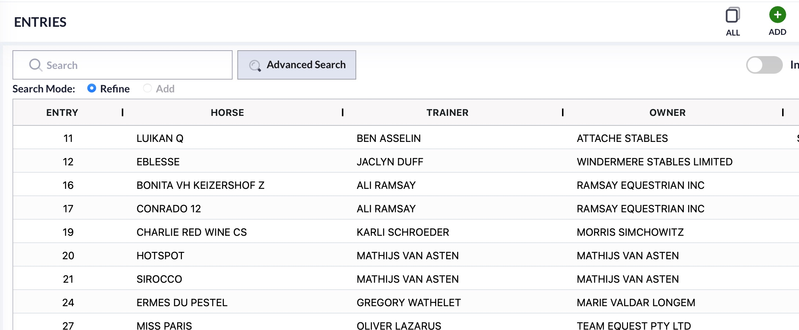

# Providing Beta Feedback to SGL

## What is the Feedback Used For?

Any feedback regarding the beta system will allow SGL to make any necessary changes to the program before launching the production version. Whether the feedback regards a bug or just a change, users are encouraged to provide our team with that feedback.&#x20;

## How Do I Provide Feedback?

We have embedded a link into the beta site to allow easy access for users to provide feedback.&#x20;

<figure><figcaption></figcaption></figure>

You will find the option, "Contact Support" on the left side of the screen, above the navigation menu. Choosing this option will open a new tab with the fillable form.&#x20;

The form will automatically fill with the logged in user's information.&#x20;

When providing feedback, we will ask for the show that you are working out of, the specific module, and a detailed description of the bug or change that you are noticing when testing. We also have the option for you to add screenshots to aid in the explanation of the issue.&#x20;

<figure><figcaption>
This is the information that will need to be provided in that form. 
</figcaption></figure>

This form, once completed, will go directly to our team's task list. Then, we can start looking into the specifics and determine the best steps moving forward.&#x20;

<figure><figcaption></figcaption></figure>

## How Will I Know My Issue Has Been Fixed?&#x20;

As any changes are made in the beta system, we will have a section of the cloud launch documentation specifically for these updates. We will also reach out directly to any individual who has provided feedback with an update on how the issue/change is being handled. We will also include any beta updates in the release notes that are emailed out.&#x20;

Users can refer to the [Beta Updates](beta-updates.md) section of documentation at any time to review any changes that have been implemented on the Beta site.&#x20;
