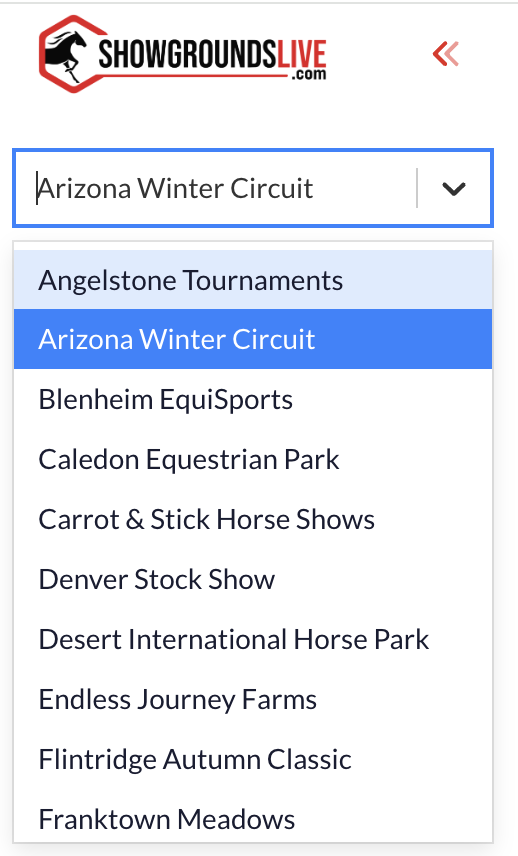

# New Navigation

## The Palette

We have had our main navigation to our legacy system in the form of a "Palette".  You are all familiar with this.  We have gotten rid of this in favor of a navigation system that runs along the left side of the browser window.

<figure><figcaption>
Ye Old Pellette
</figcaption></figure>

## New Left Navigation

Along the left side of the browser window is the main navigation.  The same options are available but they have been organized a little differently.  You will notice several things about this navigation.  The modules are now organized into Groups.  The image below shows all the groups collapsed.  Please note that the entire left navigation can also be collapsted using this button

<figure><figcaption></figcaption></figure>

<figure><figcaption>
Expanded Version of the Lef Navigation
</figcaption></figure>

### Changing Show Companies

You can switch between show companies that you have access to by selecting the drop down at the top of the left navigation.

<figure><figcaption></figcaption></figure>

### Menu Groups

As a way to keep the user interface simpler we have grouped modules iinto themes or groups.  You can expand and collapse these groups according to your needs.  The collapsed or expanded state is stored in your personal preferences and will stay consistent from session to session.&#x20;

_The current groupings are_

#### Horse Shows

<figure><figcaption></figcaption></figure>

#### RTO's | Horses | Stables

<figure><figcaption></figcaption></figure>

#### Financials

<figure><figcaption></figcaption></figure>

Tools

<figure><figcaption></figcaption></figure>

#### Places

<figure><figcaption></figcaption></figure>

