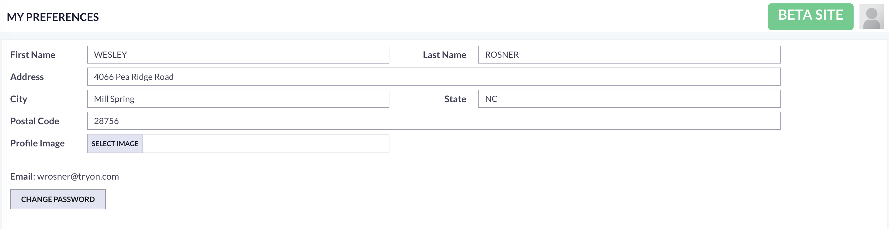

# User Preferences

## Overview

Management of user preferences has been enhanced significantly.  Most of the features of user preferences are automatic or hidden from the user.  These preferences have to do with ways the system tracks how you use it and retains those settings.  Read more below

## User Preferences Panel

You can edit your user preferences by clicking the icon in the upper right of the browser window.  \

### User Preferance Panel

<figure><figcaption></figcaption></figure>

### Setting Avatar

## Automatic Preferences

###

